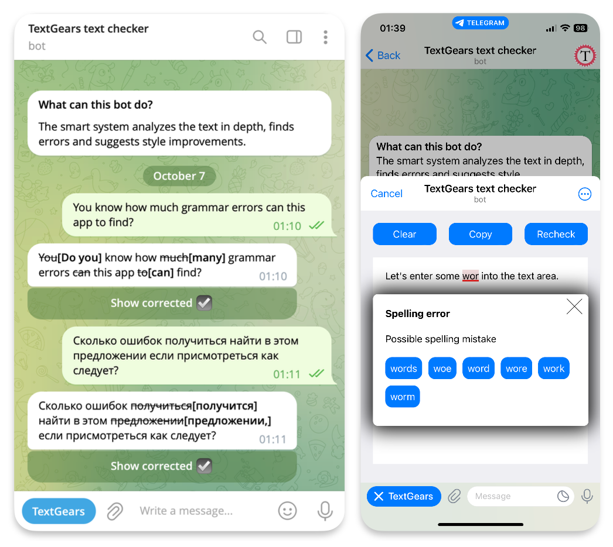

# Text checking Telegram bot and Mini App

Available languages: **EN** [RU](docs/ru/README.md)

The Web App will be useful to users who want to avoid errors in the text.
At the same time the app source code will be interesting for developers as an example of a simple content editing application.

The code is designed to make it as easy as possible for developers to use parts of it or
separate components for development purpoess or use the entire project as a framework for a future application.
To provide such flexibility, no frameworks were used, and the frontend is as cross-browser compatible as possible.

Available on Telegram: [https://t.me/TextGearsBot](https://t.me/TextGearsBot)
As a website: [https://text-correction.com](https://text-correction.com)

What can this app do?

Or you can check your text inline. Just start your messages with the bot name. For example:
`@TextGearsBot You know how much grammar errors can this app to find?`

## How it works

In fact, the application consists of two parts. The frontend is responsible for the visual part of the application.
The backend is written in PHP and is responsible for processing requests from the frontend, processing incoming updates from Telegram and the logic of the bot itself.
To implement the text analysis, the backend uses [a third-party API](https://textgears.com/api), which gives a 50% discount to all developers of bots and apps for Telegram.
If you are only interested in the frontend, you can use that API instead of the backend.
If you are making a bot, you can do without a frontend at all.

## Getting started

If you have not registered a new bot on Telegram, contact a special Telegram bot [BotFather](https://t.me/BotFather) to register one.

If you need bot functionality only, you can run it locally, no even server required!

To run Mini App or let Telegram send requests using webhook, you should copy this code to your server. Webserver's document root must be set to a fullpath of `public` directiory of this repository.

### [Frontend](./frontend.md)

### [Backend](./backend.md)
